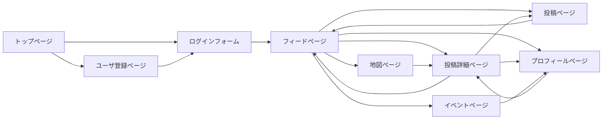

# 個人開発_写真共有アプリ_要件定義書
## 目的
写真部内での活動で撮影した写真の共有をし、写真スポット情報の交換や、メンバー間の交流を促進することを目的とする

## 機能要件
### PS_01：写真投稿
ユーザはPCやスマホから写真を投稿することができる
入力内容としては、「写真」「簡単な説明」「場所」「タグ」を想定している
写真は最大10枚までの複数枚投稿に対応する

### PS_02：アルバム作成
イベントや画像のテーマごとにユーザの投稿をまとめる

### PS_03：タグ付け機能
投稿に対して自由なタグを付与できるようにし、タグを用いた分類・検索・フィルタリングを可能にする

### PS_04：地図と連携
投稿に含まれる位置情報をもとに、地図上に撮影場所を表示する。Google Maps等のAPI連携を想定

### PS_05：コメント・リアクション
投稿された写真にコメントやリアクションをつけられるようにし、メンバー間での交流を図る
コメントはテキストのみとする
コメントの削除・変更は投稿者自身のみが可能

### PS_06：イベントなどの参加管理
撮影会などのイベント情報(日時・場所・集合方法・参加者)を登録・表示・編集できる機能。参加表明やコメントも可能にする

### PS_07：通知機能
自身の投稿に対するリアクションやイベント更新などに対する通知
アプリ内通知とメール通知を用意
メール通知はユーザ側でon/offを設定可能とする

### PS_08：投稿管理
自身が投稿した写真やイベントに対してのみ削除・変更が可能

### PS_09：ユーザロール管理
「運営メンバー」は一般ユーザに対して管理操作(投稿削除・報告対応など)が可能

## 画面要件
### FR_01：トップページ
ログインフォームと、ユーザ追加へのリンクを作成し、ユーザの認証を実施

### FR_02：フィードページ
最新投稿から順に画面内に投稿内容を表示

### FR_03：地図ページ
投稿された内容のうち場所があるものを地図内にポインティング

### FR_04：投稿詳細ページ
投稿された内容の詳細(画像、説明、タグ、場所、コメントなど)を表示

### FR_05：イベントページ
開催中のイベント一覧、詳細確認、参加表明などを行う

### FR_06：ユーザプロフィールページ
各ユーザの投稿履歴や自己紹介などを表示

### FR_07：投稿ページ
写真・簡易な説明・場所・タグなどを入力して新規投稿を行う

### FR_08：ユーザ登録ページ
新規ユーザの情報を追加する
入力内容としてユーザ名、メールアドレス、パスワードを想定している

## 画面遷移図

## 非機能要件
### NFR_01：セキュリティ
- ユーザ認証にはパスワードのハッシュ化(Bcrypt)を用いる
- 投稿・コメント・ユーザ情報などの操作にはログイン済みユーザのみがアクセス可能とする

### NFR_02：パフォーマンス
- 写真のアップロードは最大10MB(複数枚の場合、最大100MB)までとし、アップロード時に自動でリサイズ・圧縮を行う。
- アップロード可能な拡張子は JPEG,PNG,BMP,HEICとする
- フィードページの読み込みは3秒以内を目標
- 地図情報は遅延読み込みを採用。初期表示の負荷を軽減

### NFR_03：可用性・信頼性
- 投稿データやユーザ情報のバックアップを行う
- サーバ障害時にも復旧可能な構成を検討

### NFR_04：拡張性
- 写真投稿やイベント機能は、将来的に「ランキング」や「コンテスト」などの追加機能を想定して設計する
- APIベースの設計として、モバイルアプリや他サービスとの連携を可能にする
- API内容は別紙に示す

### NFR_05：保守性
- 可能な限りメンテナンスフリーな環境を利用
- gitによるバージョン管理を行う

### NFR_06：ユーザビリティ
- スマートフォンでの利用を前提としたレスポンシブデザインの採用
- 写真投稿やイベント参加など、主要操作は3ステップ以内に完了できるように設計する

## 備考
- 検索機能について
説明文内の文字列に対する部分一致による検索や場所情報からの検索(例：岡山県内の投稿検索)などは今後の拡張機能とする